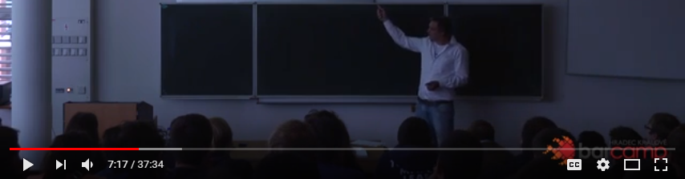

# TALKS

Resources, slides and videos from my talks.

## 2015
**Chrome Extensions**  \[CZ\]
 * 10.10. [Barcamp Hradec](https://www.facebook.com/events/1492261204405195)
 * [YouTube video](https://youtu.be/q8WDGTUZixA) 37 minutes

## 2016
**Google Chrome Extensions**  \[CZ\]
 * 1.6. [GDGrill 4.0](https://www.facebook.com/events/841603239284682)

**JetBrains IDEs tipy a triky**  \[CZ\]
 * 15.10. [Barcamp Hradec](https://www.facebook.com/events/927186954070871)
 * [YouTube video](https://youtu.be/hml-2Fjy4Y4) 66 minutes

## 2017
**Continuous Integration is a MUST**  \[CZ\]
 * 17.8. [Summer Lightning Storm Hradec Králové](https://www.facebook.com/events/251578875355379)
 * [PDF Slides](continuous-integration-is-a-must/continuous-integration-is-a-must.pdf) 13 stran
 * [Powerpoint](continuous-integration-is-a-must/continuous-integration-is-a-must.pptx)

**Přepíšeme to od nuly - ne, fakt ne**  \[CZ\]
 * 14.10. [Barcamp Hradec](https://www.facebook.com/events/302410156829117)
 * [YouTube video](https://youtu.be/6qzZWpeS3Uk) 23 minutes 

**ReasonML & OCaml**  \[CZ\]
 * 13.11. [Quadient](https://www.quadient.com/) internal (insights from conference [ReactiveConf](https://reactiveconf.com))
 * [YouTube screen capture & audio](https://youtu.be/MWSJOatjvUQ) 20 minutes
 * [PDF Slides](reasonml-and-ocaml/reason.pdf) 25 pages
 * [Markdown](reasonml-and-ocaml/reason.md)

**Bad Code Smells & Quality Tactics**  \[CZ\]
 * 30.11. [It Insider MEET UP](https://www.facebook.com/events/129228497767716)
 * [PDF Slides](bad-code-smells/bad-code-smells.pdf) 20 pages
 * [Markdown](bad-code-smells/bad-code-smells.md)
