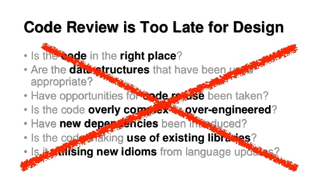

# Bad Code Smells
<hr>
Ah, but when you smell a problem, you only know that you have to fix something. You still have to look to find exactly what needs fixing.

**The smell is only a symptom.**

<hr>
Michal *Miky* Jankovský

30.11.2017

https://github.com/Michal-Miky-Jankovsky/talks


## Motivace
sedmým rokem programátor aktuálně @<br> 
<br>

 


## Agenda
 * *BAD CODE SMELLS & QUALITY TACTICS*
 * *KATEGORIE*
    * **výkonnost** - performance 
    * **bezpečnost** - security
    * **udržovatelnost** - maintainability
    * **spolehlivost** - reliability
    * *testovatelnost* - testability


https://www.software.ac.uk/blog/2016-10-06-wtfsmin-indicator-code-quality



https://www.slideshare.net/trishagee/code-review-matters-and-manners


## **Bad Code Smells** & <br> **Quality Tactics** 
**pomáhají vyvarovat se problémům v kódu ještě dříve, než ho napíšete.**
<hr>
https://slideslive.com/38900584/naucte-se-taktizovat-s-pomoci-bad-code-smells-a-quality-tactics


## **Bad Code Smells** & <br> **Quality Tactics** 
 * každý systém je jedinečný,
 * nelze aplikovat všechna pravidla na sto procent,
 * je třeba klást důraz na ty, které jsou pro *konkrétní případ* důležité.


## Kód může "zavánět" v kategoriích 
 * *pro manažery* (a vývojáře)
     * **výkonnost** (performance) 
     * **bezpečnost** (security)
 * *pro vývojáře*
     * **udržovatelnost** (maintainability) 
     * **testovatelnost** (testability) 
     * **spolehlivost** (reliability)


## Když to smrdí moc, tak to pozná (skoro) každej
http://www.hovnokod.cz
```c++
if (result == true)
    return true;
else
    return result;
```

```php
$dph = $cenaBezDph + $dph - $cenaBezDph;
```

```html
<p>&nbsp;&nbsp;&nbsp;&nbsp;&nbsp;&nbsp;&nbsp;MENU</p>
```

```php
if(!function_exists('function_exists')) {
    function function_exists($f) {
        return function_exists($f);
    }
}
```


## Developer je ten,<br> kdo musí trvat na kvalitě

**Software může být...** (vyber jen dva --Larry Wall)
 * *kvalitní*
 * **rychle dodaný**
 * **levně vyvinutý**
 
Obchoďák to nebude udržovat...

http://solve100.com/the-good-fast-cheap-complex


## Psát svůj framework...
 * není nad to si to po&ast;&ast;&ast; vlastním způsobem
 * *odladit kvalitu trvá*
    * ani se stackowerflow to nezachrání
    * bugy se ladí měsíce
 * **přesná funkcionalita**
    * Paretovo pravidlo (Pravidlo 80/20)

<hr>
https://youtu.be/6qzZWpeS3Uk<br>
Barcamp Hradec - Přepíšeme to od nuly - ne fakt ne


## third party software
 * kompromis ve funkcionalitě
 * **middleware**
    * lepidlo na software
    * https://en.wikipedia.org/wiki/Middleware
 * **důvěra v autora / komunitu**


## pár tipů... ;)
 * *KISS* - Keep It Simple Stupid
 * **kompozice** radši než dedičnost
 * **factory metody** radši než konstruktory
    * snažší refactoring v budoucnu
    * https://refactoring.guru/replace-constructor-with-factory-method
 * myslet na každý kus kódu jako samostatnou komponentu
    * testability
    * jednodušší závislosti


## Jsou komentáře špatné?
 * já je mám rád... :\)
 * ale jsou u nás ve firmě lidi...
    * podle knihy write readable code jsou zbytečné
    * někteří lidé jsou schopni "číst" algoritmy
 * je to pro mě ulehčení "znovu pochopení" (ať už v řádu minut, hodin nebo dní)
 * bacha - zároveň práce navíc - *musí být aktuální!!!*


## Testability 1
http://robertvbinder.com/

 * [Part 1: Testability: What is it?](http://robertvbinder.com/software-testability-part-1-what-is-it/)
 * [Part 2: Controllability and Observability](http://robertvbinder.com/software-testability-part-2-controllability-and-observability/)
 * [Part 3: Accidental Untestability](http://robertvbinder.com/software-testability-part-3-white-box-complexity/)
 * [Part 4: White Box Testability](http://robertvbinder.com/testability-part-4-white-box-strategies/)
 * Part 5: Black Box testability (not posted yet)
 * Part 6: The Role of Test Automation (not posted yet)
 * Part 7: Why Testers get No Respect  (not posted yet)


#### [Part 1: Testability: What is it?](http://robertvbinder.com/software-testability-part-1-what-is-it/)
6 testability factors:
 * representation
 * implementation
 * built-in test
 * test suite
 * test tools
 * test process


<br>
**Senior je ten co už udělal většinu juniorských chyb.**


## Závěr
 * *přemýšlejte ještě než něco napíšete*
 * **refactoring později nikdo nezaplatí<br>a vy se z toho ...**


## Diskuze

<br>
[@MichalJankovsky](https://twitter.com/MichalJankovsky)