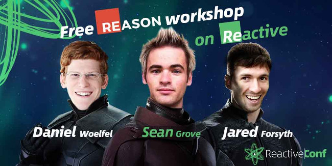

# Reason (ML)
## & OCaml


Michal **Miky** Jankovský


## Proč jsme tu

https://reactiveconf.com


## Opravdu zajímavých témat bylo mnoho
 * GraphQL subscriptions
 * Logux
 * GlimmerVM
 * style-elements
 * Převod aplikace z NG do Reactu
 * Replicated Object Notation
 * Vue (animace)
 * bundle splitting
 * D3


## Jak jsem potkal ReasonML
ReactiveConf vypsala workshop...

<table>
    <tr>
        <td></td>
        <td style="vertical-align: middle;">
            matně si vybavuju z twitteru<br/><br/>
            FUNCTIONAL PROGRAMMING FOR THE MASSES
        </td>
    </tr>
</table>


## Jak jsem potkal ReasonML 1
26.10. Reason: JavaScript-flavored OCaml - Jared Forsyth

dojem *dost dobrý*


## Jak jsem potkal ReasonML 2
26.10. network(dr)ing - "Maty"

dojem *úplně nejvíc nejlepší*


## Jak jsem potkal ReasonML 3
 * 27.10. workshop - Sean, Jared, Daniel

dojem *syntax... WTF*




## Jak jsem potkal ReasonML 4
 * muj pruzkum... ;\)
    * dokumentace
        * https://reasonml.github.io
        * https://ocaml.org
    * blogy
    * youtube
 * discord chat
    * oficiální kanál (support a diskuze)
    * https://discordapp.com/invite/reasonml
 * příprava na tenhle talk


## Agenda
 * *OCaml*
    * Historie
    * Hlavní výhody
 * *ReasonML*
    * Cíl
    * Syntaxe
    * Toolchain
    * Aktuální stav
 * **Ukázka kódu**


## OCAML - Historie
 * 1981 | LCF proof assistant
 * 1985 | CAM (Categorical Abstract Machine)
 * 1987 | CAM + ML (Meta Language) = Caml
 * 1990 | Caml Light
 * 1995 | Caml Special Light
 * *1996 | Objective Caml*
 * **2011 | Renamed to OCaml**

https://ocaml.org/learn/history.html


## OCaml - top benefits
 * funkcionální, ale rozšířený o objektové struktury
 * s důrazem na *rychlost a bezpečnost* již od návrhu
    * bezpečná alokace paměti (žádné přetečení)
    * nejrychlejší garbage collector vůbec (pouze v jednom vlákně)
 * **silně typovaný** jazyk
    * "fully *soundness*" https://en.wikipedia.org/wiki/Soundness
    * type inference (typy jsou odvozeny z kontextu)
 * immutabilita (ale výjimky jsou povoleny)


## OCaml - top benefits 2
 * FFI - Foreign Function Interface
    * možnost napojení na jiné jazyky
 * debugger umí krokovat oběma směry
 * tree-shaking ale nejen funkce i větve v ifech a switchich
 * pattern matching
 * uni-kernels (binarka + mini linux = iso)


## ReasonML
https://github.com/facebook/reason

Simple, fast & type safe code that leverages the JavaScript & OCaml ecosystems


## ReasonML - Cíl
OCaml je skvělý, ale developerů je málo, co s tím?
 * **tak OCaml zůstane** *jen na pozadí*
 * **zkrátit čas nastavení Reason prostředí**
    * z 2-3 dní na "```npm install```"
 * **intuitivnější syntaxe**
    * *konverze* mezi verzemi syntaxe *je zadarmo*
        převedení na **AST (Abstract Syntax Tree)** 
        a pak jakýkoli **fully Soundness** jazyk
        (Reason v2, Reason v3, FlowType)
    * konkétně cíli na JS programátory (ReactReason)


## ReasonML - Toolchain
Reason =\> Ocaml =\> BuckleScript =\> Javascript

(Flow + Babel + ESLint + Prettier)
reason do it even better

merlin - poskytuje IDE všechny tooltipy, warningy a intelisense


## ReasonML - aktuální stav
 * **Reason jeste neni "*production ready*"**
    * hlavní soustředění je teď na JavaScriptovou část
    * realistický odhad - *zbývají 2 roky*
        * **Jared** říkal před půl rokem "půl roku"
          https://jaredforsyth.com/2017/06/23/when-will-reasonml-be-ready/
        * **Sean** říká 1 - 2 roky
        * **Maty** 2 - 3 roky
 * **Zatím malá komunita**
    * na discordu max 190 lidí online celosvětově


## Ukázky kódu
 * FFI čistý javascript
 * Ocaml VS Reason
 * React Reason


## FFI čistý javascript
reference na js funkci

použití

http://szymonkaliski.com/blog/2017-05-31-exploring-reasonml


## Camel vs Reason


https://reasonml.github.io/guide/ocaml


## Camel vs Reason 2
pattern matching

asymptotická složitost O(1)


## ReactReason


## Závěr
 * *OCaml funguje přes 20 let* (35 let se vyvíjí)
 * *Funkcionální Programování* **dává smysl, tak proč ne v Reasonu**
    * syntaxí je mnohem blíž "běžnému" programátorovi než čistý OCaml / Haskell


## Závěr 2
 * *Facebook má už teď v Reasonu velkou část svého produkčního kódu* a přepis pokračuje
    * (celý FlowType, přes půlku messenger.com, část instagramu)
    * **bude ho udržovat**
    * **bude ho vylepšovat**


## Závěr 3

http://dev.stephendiehl.com/nearfuture.pdf


# Q&A